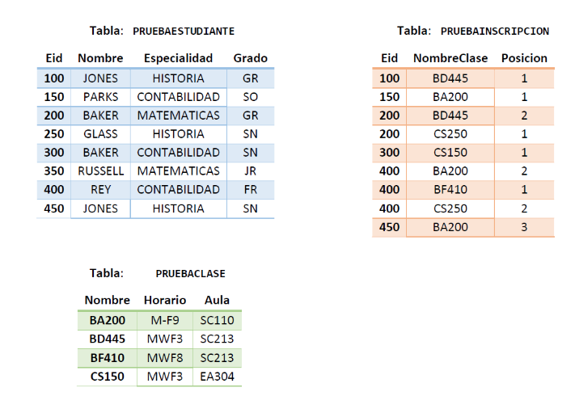
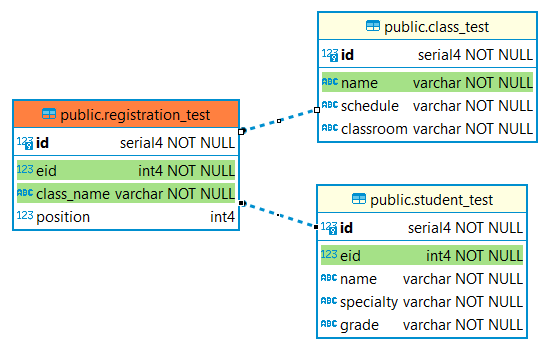
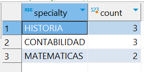
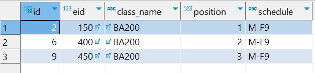

# Prueba técnica Amaris

## Conocimientos SQL

### 1. Explique brevemente para que sirve una vista.

 Una vista es una consulta predefinida que actúa como una tabla virtual. Permite simplificar el acceso a datos complejos al contener una consulta que puede ser reutilizada. Sirve para mejorar la seguridad, ya que permite restringir el acceso a datos sensibles al mostrar solo las columnas o filas necesarias, y también ayuda en la organización de consultas repetitivas, manteniendo el código más limpio y fácil de mantener. Además, las vistas no almacenan datos por sí mismas; solo muestran los resultados de la consulta en tiempo real.

### 2. ¿Cuál es el objetivo de un JOB?

 El objetivo de un JOB en bases de datos, es automatizar tareas repetitivas o programadas. Un JOB es un proceso que se configura para ejecutarse de manera automática en momentos específicos o bajo ciertas condiciones, como hacer respaldo de datos, ejecutar consultas complejas, procesar grandes volúmenes de información o enviar reportes. Así, se ahorra tiempo y se asegura que las tareas críticas se realicen de forma consistente sin intervención manual.

### 3. Explique cuál es la característica y en qué se diferencia: TRUNCATE, DELETE, DROP

| Comando  | Características                                                                                                                                   | Diferencias                                                                                                                |
|----------|----------------------------------------------------------------------------------------------------------------------------------------------------|----------------------------------------------------------------------------------------------------------------------------|
| TRUNCATE | - Elimina todos los datos de la tabla.                                                                                                             | - No permite condiciones (WHERE).                                                                                          |
|          | - Mantiene la estructura de la tabla (columnas, índices, relaciones).                                                                               | - Es más rápido que DELETE porque no registra la eliminación fila por fila en el log de transacciones.                     |
|          | - No registra cada fila eliminada en el log de transacciones.                                                                                       | - No puede ser revertido si no se usa dentro de una transacción.                                                           |
|          | - No activa triggers (disparadores).                                                                                                               |                                                                                                                            |
| DELETE   | - Permite eliminar filas específicas usando una condición (WHERE).                                                                                  | - Es más lento que TRUNCATE porque registra cada fila eliminada en el log de transacciones.                                 |
|          | - Mantiene la estructura de la tabla.                                                                                                              | - Se puede revertir usando ROLLBACK si se ejecuta dentro de una transacción.                                               |
|          | - Activa triggers (si existen) para las filas eliminadas.                                                                                           | - Puede ser más lento si se eliminan muchas filas.                                                                         |
| DROP     | - Elimina la tabla o base de datos completa, incluyendo todos los datos y su estructura.                                                            | - A diferencia de TRUNCATE y DELETE, elimina tanto los datos como la estructura de la tabla (o base de datos).             |
|          | - No se puede recuperar la tabla ni los datos después de ejecutarse.                                                                                | - No se puede usar con condiciones (WHERE).                                                                                |
|          | - Es más rápido que TRUNCATE y DELETE porque no deja rastro en el log de transacciones ni necesita procesar fila por fila.                          | - No puede ser revertido fácilmente, ni siquiera dentro de una transacción.                                                |


### 4. Si se tiene una lista de números desordenada { 8,1,7,2,0,3,6,4,5,9} y se desea obtener como único resultado el dato con mayor valor, ¿Cuál de las funciones de SQL se debe utilizar? 
 
Se debe utilizar la función `MAX`

 ```
 SELECT MAX(valor) AS Maximo
 FROM Numeros;
```

### 5. ¿Para qué se utiliza la cláusula Having?

La cláusula HAVING se utiliza para filtrar los resultados de una consulta después de aplicar una función de agregación, como `SUM`, `COUNT`, `AVG`, `MAX`, `MIN`, etc.

Diferencias clave con WHERE:

- **WHERE:** Filtra filas antes de aplicar funciones de agregación. Se usa para condiciones en datos individuales.
- **HAVING:** Filtra los resultados después de aplicar funciones de agregación. Se usa para condiciones en datos agregados.


---
#### De acuerdo al modelo


>#### Modelo SQL
> 

### 6. ¿Cuál es el nombre de las especialidades registradas y la cantidad de veces que existe en la tabla?

```
SELECT ESPECIALIDAD, COUNT(*) AS CANTIDAD
FROM PRUEBAESTUDIANTE
GROUP BY ESPECIALIDAD;
```

``` SQL
SELECT specialty, COUNT(*) AS count
FROM student_test
GROUP BY specialty;
```


### 7. ¿Cuáles son las inscripciones que tienen horario M-F9?

```
SELECT PI.EID, PI.NOMBRECLASE, PC.HORARIO, PC.AULA
FROM PRUEBAINSCRIPCION PI
JOIN PRUEBACLASE PC ON PI.NOMBRECLASE = PC.NOMBRE
WHERE PC.HORARIO = 'MF-F9';
```

``` SQL
SELECT rt.id, rt.eid, rt.class_name, rt."position", ct.schedule
FROM registration_test rt
JOIN class_test ct ON rt.class_name = ct.name
WHERE ct.schedule = 'M-F9';
```

---

## Conocimientos HTML y CSS3
Este ejercicio consiste en la creación de un currículum vitae multi-página utilizando HTML y CSS3, con un enfoque en la diagramación, estructura semántica y diseño visual. El objetivo es demostrar competencias clave en maquetación y uso de hojas de estilo.

[Mi Curriculum](curriculum-vitae/)

---

## Ejercicios JavaScript
Este ejercicio consiste en la creación de dos funciones matemáticas utilizando JavaScript. El objetivo es demostrar habilidades básicas en el desarrollo de funciones para resolver problemas geométricos. La primera función calcula el área de un triángulo a partir de los valores de su base y altura, mientras que la segunda función calcula el área de un círculo dado su radio. Estas funciones ilustran el manejo de operaciones aritméticas y el uso de parámetros en JavaScript.

[Ejercicios Áreas](ejercicios-areas/areas.js)

---

## Ejercicio Backend
El ejercicio consiste en construir un microservicio de gestión que realice operaciones CRUD sobre la tabla PRUEBAESTUDIANTE, utilizando Java con Spring Boot. El desarrollo del microservicio debe implementar las diferentes capas de arquitectura, como la capa de persistencia, la capa de datos y la capa de lógica de negocio. El objetivo es demostrar habilidades en la construcción de microservicios, utilizando las mejores prácticas de arquitectura de software y respetando la separación de responsabilidades en cada capa.

[Ejercicio Backend](ms-student-test/)

> Visualizar el API
>
> [Swagger MS Student Test](http://localhost:8080/ms-student-test-api/swagger-ui/index.html#/)
